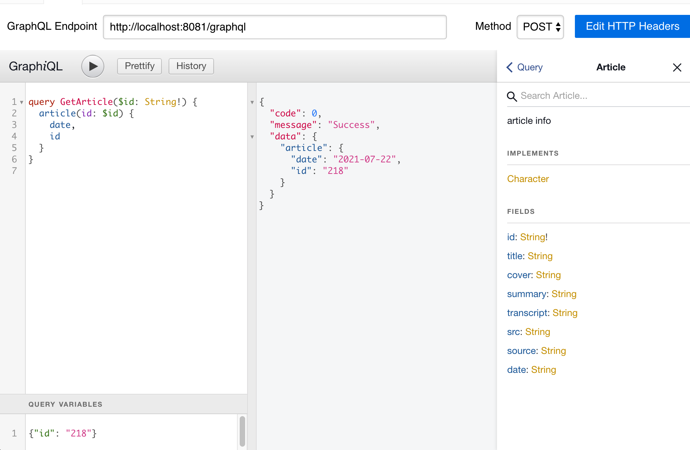

> **The main branch is under active development**

## dev

1. create virtual env

    - `python3 -m venv .venv`
    - `source <venv>/bin/activate`

2. install deps `python3 -m pip install -r requirements.txt`

3. change config

    - rename `.example.env` to `.env`

4. start app `python3 app.py`
5. run spider `python3 -m app.spider.pbs_article`
6. register admin user `python3 -m app.bin.gen_admin_user`

## docker deploy

1. build image `docker build -t taishan-server:alpine .`
2. run `docker-compose up -d`
3. upgrade app `docker-compose pull && docker-compose up -d`

## graphql explorer

